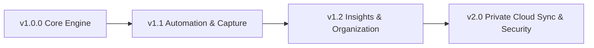

# 🗺️ Lumina Expense — Post-v1 Strategic Roadmap

This document outlines the planned feature additions and architectural expansions for **Lumina Expense** following the initial v1.0.0 release.

---

## 📅 Roadmap Overview

---

## 🚀 Phase 7: Version 1.1 — Smart Automation & Capturing

### 1. On-Device Receipt OCR Scanner
* **Goal**: Take a photo or pick a receipt from gallery and auto-detect Amount, Store Name, and Date.
* **Architecture**: Use `google_mlkit_text_recognition` for 100% on-device, private OCR (no external cloud API or data leakage).
* **UI**: A camera scan icon inside `AddTransactionSheet` that extracts the highest price and merchant title into the input fields.

### 2. Bank SMS / Notification Auto-Logger (Android)
* **Goal**: Detect transactional SMS from banks/wallets and pre-fill the transaction dialog.
* **Architecture**: Local regex engine matching common transaction templates (`telephony` / notification listener).
* **Privacy**: User customizable regex whitelist, zero transmission of SMS content outside the device.

### 3. Recurring Transaction Scheduler & Notification Alerts
* **Goal**: Schedule recurring fixed bills (Rent, Netflix, Insurance) with local notifications before the due date.
* **Architecture**: `flutter_local_notifications` + Drift background runner.

---

## 📊 Phase 8: Version 1.2 — Advanced Financial Insights & Multi-Currency

### 1. Cash Flow Calendar & Heatmap View
* **Goal**: Visual calendar showing daily spending intensity (color heatmap) and upcoming bill dots.
* **UI**: Interactive calendar grid with day-tap inspection of daily transaction logs.

### 2. Multi-Currency with Offline FX Rate Caching
* **Goal**: Record expenses in different currencies (e.g. while traveling) with auto-conversion to base currency.
* **Architecture**: Local cached currency table with periodic offline-friendly exchange rate updates.

### 3. Split Transaction Wizard
* **Goal**: Split a single grocery or mall receipt across multiple categories (e.g., $100 total = $70 *Groceries* + $30 *Personal Care*).
* **Architecture**: Support 1-to-many transaction-category item allocations in Drift database.

### 4. PDF Statement Generator
* **Goal**: Export professionally formatted monthly PDF financial summaries for tax reporting or personal records.
* **Architecture**: Use `pdf` and `printing` packages.

---

## 🔒 Phase 9: Version 2.0 — Private Cloud Sync & Advanced Security

### 1. Encrypted WebDAV / Nextcloud / Syncthing Sync
* **Goal**: Optional automatic syncing between devices using user's private self-hosted WebDAV or Nextcloud server.
* **Architecture**: CRDT / Delta-sync engine over SQLite.

### 2. AES-256 Encrypted Backups
* **Goal**: Optional password/passphrase encryption for exported `.json` backups.
* **Architecture**: `cryptography` package with Argon2 key derivation.

### 3. Biometric App Lock & Privacy Shield
* **Goal**: Require Fingerprint / Face ID / PIN to unlock the app, with window blurring when switching apps in the OS task switcher.
