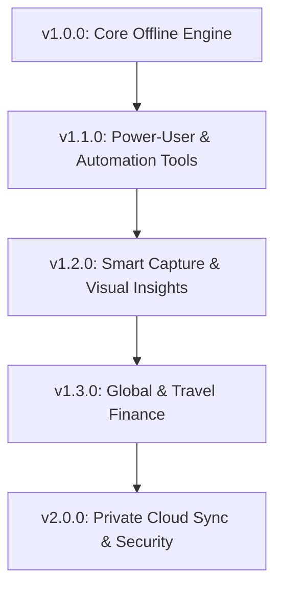

# 🗺️ Lumina Expense — Comprehensive Post-v1 Strategic Roadmap

This document outlines the planned feature additions, architectural expansions, and release milestones for **Lumina Expense** following the initial v1.0.0 release.

---

## 📅 Multi-Phase Release Overview

---

## 🚀 Phase 1: Version 1.1.0 — Power-User Tools & Automation

### 1. 🎯 Savings Goals & Sinking Funds
* **Goal**: Allow users to set milestone targets (e.g. *Emergency Fund*, *New Laptop*, *Vacation Fund*) with target dates and amounts.
* **Architecture**: New `Goals` table in Drift with deposit/withdraw transfers linked to accounts.
* **UI**: Progress cards, days remaining countdown, and required monthly contribution calculations.

### 2. 🧾 Split Transactions
* **Goal**: Allocate a single transaction across multiple categories (e.g. $100 supermarket bill = $70 *Groceries* + $30 *Household*).
* **Architecture**: `TransactionSplits` table with cascading foreign keys to `Transactions` and `Categories`.
* **UI**: Category split modal with remaining allocation validation; donut chart aggregation.

### 3. 🔄 Subscriptions & Recurring Bill Scheduler
* **Goal**: Track fixed recurring expenses (Rent, Netflix, Spotify, Gym) with upcoming billing alerts.
* **Architecture**: `RecurringTransactions` table + `flutter_local_notifications` + app-start catch-up runner.
* **UI**: Dedicated Subscriptions screen with monthly committed burn-rate tracker and due-date countdown chips.

### 4. 🏷️ Tags & Multi-Labeling Engine
* **Goal**: Flexible cross-cutting tags (e.g. `#Trip2026`, `#TaxDeductible`, `#WorkExpense`) orthogonal to primary categories.
* **Architecture**: Many-to-many `Tags` and `TransactionTags` tables in Drift.
* **UI**: Tag chip autocompletion and Tag-based analytical breakdowns.

### 5. 🔒 Biometric App Lock & Privacy Shield
* **Goal**: Secure app data with Face ID / Fingerprint / PIN, and blur screen in OS task switcher.
* **Architecture**: `local_auth` package + `AppLifecycleListener` privacy overlay.

---

## 📸 Phase 2: Version 1.2.0 — Smart Capture & Visual Insights

### 1. 📸 100% On-Device Receipt OCR Scanner
* **Goal**: Auto-extract total amount, date, and merchant from receipt photos with zero cloud data transmission.
* **Architecture**: `google_mlkit_text_recognition` + local regex price/merchant heuristic parser.
* **UI**: Instant camera scan button in transaction sheet.

### 2. 🤖 Smart Rules & Auto-Categorization Engine
* **Goal**: Heuristic matching rules (e.g. *If note contains "Uber" -> Transport; "Starbucks" -> Coffee*).
* **Architecture**: `AutoRules` table executed on transaction entry, OCR, and CSV import.

### 3. 📅 Cash Flow Calendar & Spending Heatmap
* **Goal**: GitHub-style color intensity monthly grid of daily spending burn rate and upcoming bill dots.
* **UI**: Interactive calendar grid with day-tap transaction drawer.

### 4. 📱 Home Screen & Lock Screen Quick-Add Widgets
* **Goal**: 1-tap expense logging and current month balance glance directly from the phone launcher.
* **Architecture**: `home_widget` package for Android AppWidgetProvider & iOS WidgetKit.

### 5. 📄 PDF Financial Statements & Tax Reports
* **Goal**: Export professionally formatted, printable PDF monthly summaries and tax-ready ledgers.
* **Architecture**: `pdf` and `printing` packages.

---

## 💱 Phase 3: Version 1.3.0 — Global & Travel Finance

### 1. 💱 Multi-Currency with Offline FX Rate Caching
* **Goal**: Record transactions in foreign currencies with automatic base-currency conversion.
* **Architecture**: `CurrencyRates` local table with on-demand offline-friendly refresh.

### 2. ✈️ Travel Mode / Trip Budgets
* **Goal**: Dedicated temporary trip budget isolated from daily home expenses.

### 3. 📥 Bank SMS Notification Auto-Capture (Android only, opt-in)
* **Goal**: Local regex parser matching bank transaction notification SMS with user whitelist.

---

## ☁️ Phase 4: Version 2.0.0 — Private Cloud Sync & Multi-Device

### 1. ☁️ Encrypted Private Cloud Sync (E2EE)
* **Goal**: Multi-device sync across Android, iOS, and Desktop without third-party data tracking.
* **Architecture**: AES-GCM-256 zero-knowledge encryption + WebDAV (Nextcloud/ownCloud) & Google Drive AppData sync.

### 2. 💻 Desktop Companion Apps
* **Goal**: Native full-screen desktop experiences for Windows, macOS, and Linux.
